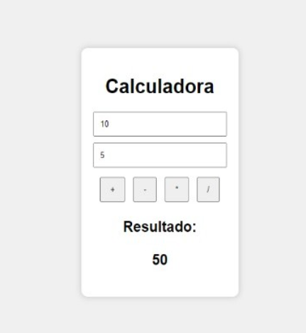
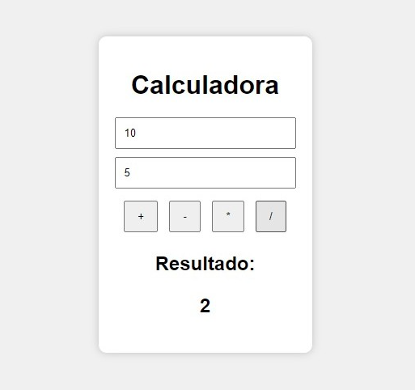

# Calculadora
Chekpoint V
# Calculadora em HTML, CSS e JavaScript

## Descrição

Projeto desenvolvido para praticar HTML, CSS e JavaScript.

A calculadora realiza:

- Soma
- Subtração
- Multiplicação
- Divisão

## Como foi implementado

### HTML

Foi utilizada a estrutura da página com:

- Dois campos de entrada
- Quatro botões
- Área de exibição do resultado

### CSS

Foi utilizado CSS para:

- Centralizar a calculadora
- Estilizar os botões
- Melhorar a aparência visual

### JavaScript

Foram criadas funções para:

- Somar
- Subtrair
- Multiplicar
- Dividir

Os valores digitados são capturados pelos inputs e o resultado é exibido na tela.

## Soma

## Subtração

## Multiplicação

## Divisão

